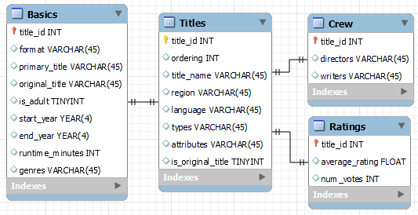

# bd-imdb

Trabalho da disciplina Banco de Dados usando **python 3.8**

## Setup

```shell
    # Crie o ambiente virtual com venv:
$ python3 -m venv .venv
    # Ative o ambiente (no Linux) com:
$ source .venv/bin/activate
    # Instale as bibliotecas com:
(.venv) $ pip install -r requirements.txt
```

## Start

Inicie a execução com:
```shell
(.venv) $ flask run [--debug]
```

## Tabelas

As tabelas usadas serão do [imdb dataset](https://www.imdb.com/interfaces/), salvas e descompactadas em [`app/data/`](app/data/).


